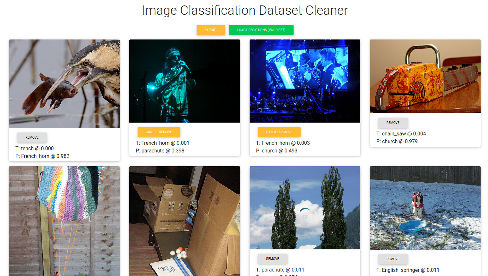

# Image Classification Dataset Cleaner

This repo provides a generic framework based on **_React_** for cleaning up noisy image classification datasets. It was originally an internal dataset cleaner for a dataset with less than 10 classes. We removed the hard-coded dataset-specific part to make it more easy to be adapted to other datasets.

It uses predictions from a trained model to identify examples whose prediction is most off (it can be a very hard example or just simply has a wrong label).

(Note: this project is still in the early development stage. It has some basic functionality, but expect to do some work if you need more advanced features.)

## Usage

Required files (For more details, see the Imagenette example.):

- valid_preds.csv: model predictions for the validation set.
- id_to_name_map.json: mapping class indices to class names.
- image files: we directly serve the image files with the React site. Please make sure the path on the HTTP server is the same as in `valid_preds.csv`. (You can use symlinks to avoid copying data.)

Click the "Remove" button on the image that has a wrong label. Click "Export" when you're done or wish to save the progress. Save the JSON file as `valid-changes.json` to the `build/` folder (use the `public/` folder when in development mode). The exported file should be used to actually removes the noisy examples from the dataset.

The cleaner will load `valid-changes.json` if exists to restore the exported annotations.

## Imagenette Example

Firstly, run `npm run build` to create an optimized build at `build/`.

[Download the example tar file](https://github.com/veritable-tech/image-classification-dataset-cleaner/releases/download/example/imagenette_example.tar.gz) and extract it into the `build/` folder (e.g., `tar zxf imagenette_example.tar.gz -C build`).

Serve the optimized build (e.g., `http-server --cors -p 8080 build/`) and access it in the browser (e.g., `http://localhost:8080`).

